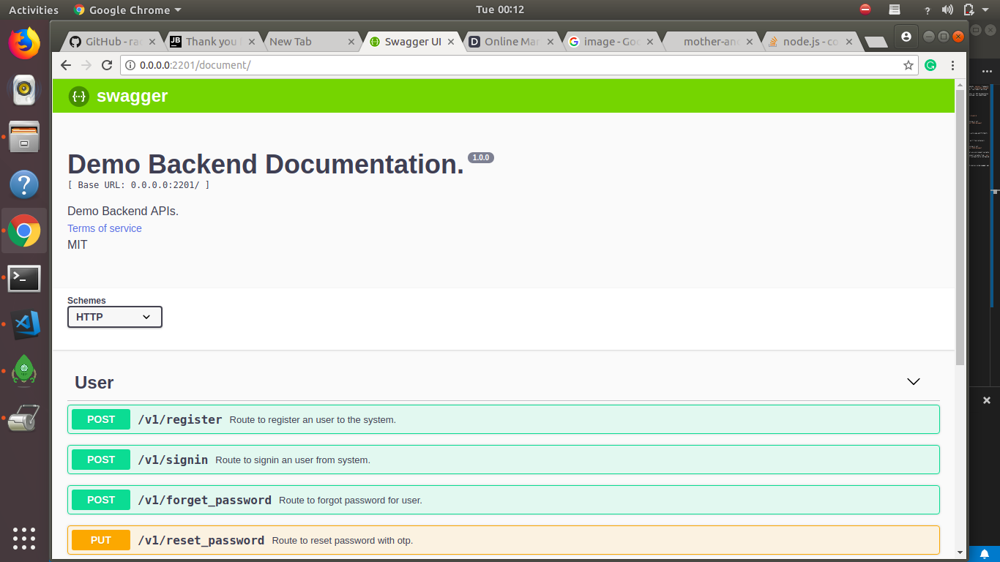

# Demo Node JS Express framework by using Swagger and bluebird
Node JS most famous framework is`Express`. Many developer recommends `express` framework to write the back-end code. People are using express because it is `customizable backend scripting language`, code can be written in pure js (ES5 or ES6), now today's world we can also write back-end code by using typescript.

In this demo we will use swagger routes with middlewares. It makes our API documentation much more attractive and understandable. So any one back-end developer can understand, what's going on.

## Requirment
 `Mongodb 3.6+`:
+ **Install MonngDB 3.6**
+ *` Ref: `* https://docs.mongodb.com/manual/installation/

`NodeJS v8+`
+ *`Ref:`* [Learn Node](http://nodejs.org)
+ Framework: [Learn Koa](https://expressjs.com/)

## Run Locally with Node
+ Clone the project:
+   ```https://github.com/radhey113/node-express-latest-swagger-bluebird```
+ Go to project working directory / Project folder
+ Execute command   `npm install`
+ After that Run Command `npm start`
+ Open `http://localhost:2201` to check that your server is running or not.
+ To check the documentation Kindly follow the: `http://localhost:4001/document`



## Run Project with Dockerfile
+ Install Docker
  + `https://docs.docker.com/install/`
      + [Run Docker image](https://medium.com/@radheyg11/docker-with-node-e6cf77cfd21f)
+ Go to terminal, Run command
  + `cd <Project directory path>`
+ Run command to create node project build
  + `docker build -t node:8 ./`
+ To Run node server (Local 2201 port mapping node server 2202 port from container)
  + `docker run -p 2202:2201 node:8`
+ To Run node server in deamon mode use command `<Parameter -d>`
  + `docker run -p 2202:2201 -d node:8`
+ Open `http://localhost:2202` to check that your server is running or not.
+ To check the documentation Kindly follow the: `http://localhost:2202/document`

##### Set environment variable
- No need to set custom environment variable, if you want to set any environment variable just add it to `.env` file.
- There is a `npm module` called `dotenv` will configure environment variable from `.env` to our system. `.env` is the default environment file which will automatically configured by the `dotenv`;
- You need to require `dotenv` on the to of the index.js file
-  i.e `require('dotenv').config()`


*I hope it will help you to create your new nodejs project with express using swagger api documentation.*
## Thank you
